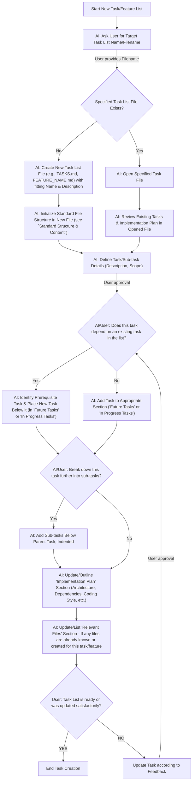

# Protocol: Feature & Task Definition

When a user initiates the creation or addition of new features, tasks, or
sub-tasks, follow this protocol. This ensures comprehensive definition and
proper integration into project task lists.

## Workflow Overview

The following Mermaid diagram illustrates the step-by-step process for feature
and task definition:

## Key Instructions for AI based on Workflow

1. **Initiation (AAA -> NEW_A):** When the user wants to add/create a task or
   feature, **always start by asking the user for the specific task list file
   name** (e.g., `TASKS.md`, `ASSISTANT_CHAT.md`) they want to work with or
   create.
2. **File Handling (NEW_B -> NEW_E):**
   - If the user provides a filename, check if it exists.
   - If it **exists** (`NEW_C`), open it and review its current content (`AAG`)
     with the user if necessary.
   - If it **does not exist** (`NEW_D`), create the file.
3. **Standard Structure & Content:** If a new file is created, **initialize it
   with the standard sections** (`# [Feature Name] Implementation`,
   `## Completed Tasks`, `## In Progress Tasks`, `## Future Tasks`,
   `## Implementation Plan`, `### Relevant Files`).
4. **Task Definition (AAG -> AAH_PRE):** Collaboratively define the new task or
   sub-task details with the user. Ensure you get a clear description and scope. Required steps could involve:
   - Creating or changing files
   - Testing code
   - Invoking cli
   - Writing tests
   - Taking screenshots
   - Verifying and validating implementation
   - Updating comments, documentation
   - Rewriting or refactoring
   - And more...
5. **Dependency Check (AAH_DEP):** **Determine if the new task
   depends on any existing task** in the list. If unsure or unclear, ask the user.
   - If yes (`AAH_POS`), ensure the new task is placed directly under its
     prerequisite task.
   - If no (`AAH`), add it to the appropriate section.
6. **Task Formatting:**
   - All tasks and sub-tasks **must** use GitHub-style checkboxes: `- [ ]` for
     incomplete tasks.
   - Sub-tasks should be indented under their parent task.
7. **Sub-Task Breakdown (AAI -> AAJ):** After a main task is defined, **determine if it needs to be broken down into smaller sub-tasks.**. If unsure or unclear, ask the user. If so, add these sub-tasks, indented below the parent.
8. **Implementation Plan (AAK):** Update or outline the `## Implementation Plan` section. Prompt for details such as:
   - Key architectural decisions.
   - Dependencies (npm packages, other services, abstraction layers needed).
   - Preferred style of coding (procedural, functional, class-based, etc.), if
     relevant.
   - **Crucially**, if these details are not specified by the user and unknown at this point, ask where
     this information can be found (e.g., existing documentation) or directly
     request the information. Emphasize the importance of documenting the
     implementation plan.
9. **Relevant Files (AAL):** Prompt the user to list any relevant files that are
   already known, created, or will be central to this task/feature.
10. **Confirmation (AAM):** Before concluding, confirm with the user that the
    task list has been updated or created to their satisfaction. If unsatisfactory, restart the workflow based on the user feedback.

## General Reminders

- Always adhere to the task file structure when creating or modifying task list files.
- Ensure that task descriptions are clear and actionable.
- If the user seems unsure about any part of the `Implementation Plan`, offer to
  help them think through it or suggest placeholders for information to be added
  later.
