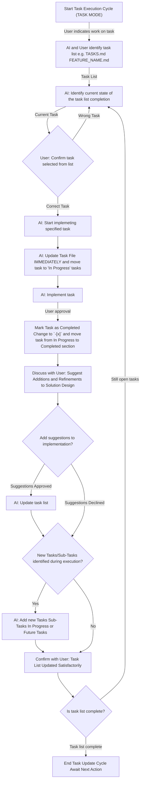

# Protocol: Task Execution & Update

When a user indicates they are working on or have completed a task from a project task list, follow this protocol. This ensures tasks are properly updated, and relevant information is captured.

## Workflow Overview

The following Mermaid diagram illustrates the step-by-step process for task execution and updating the task list:

## General reminders

- **Standard Structure & Content:** A task list file has the following sections (`# [Feature Name] Implementation`,
   `## Completed Tasks`, `## In Progress Tasks`, `## Future Tasks`,
   `## Implementation Plan`, `### Relevant Files`). **When updating maintain these sections**.
- When updating the task list reference the CREATE TASK rule (`.clinerules/create-task.md`).
- Continue with the EPCC cycle after completing this EXECUTE TASK rule.
